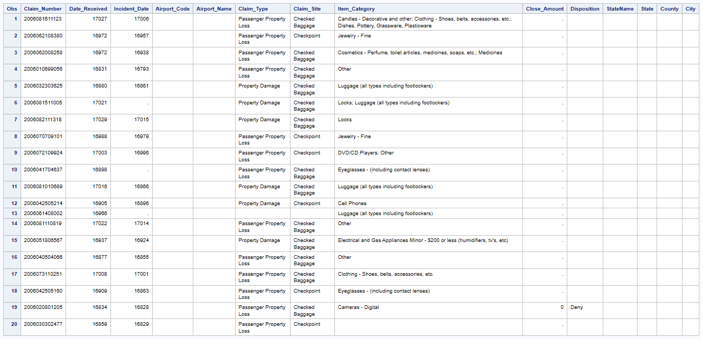
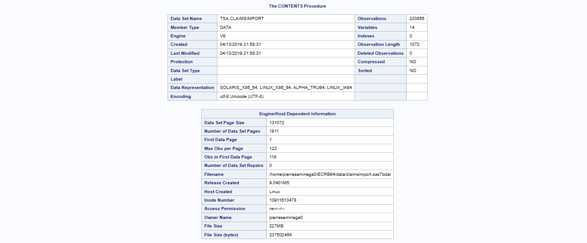
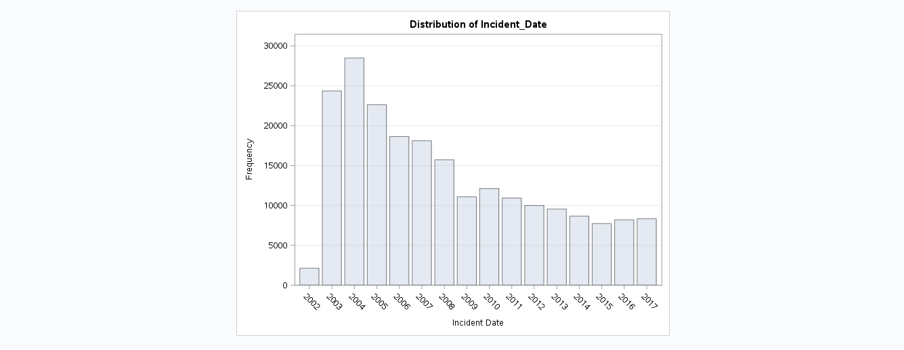
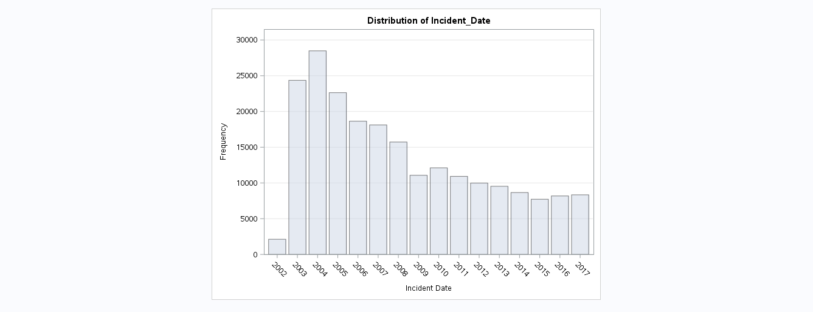

# Analyze United States TSA Claims Data

## Introduction

The TSA is an agency of the US Department of Homeland Security that has authority over the security of the traveling public. Claims are filed if travelers are injured or their property is lost or damaged during the screening process at an airport. The data in the CSV file  represents the data for claims filed between 2002 and 2017.
This file was created from publicly available data from the TSA and the Federal Aviation Administration, or FAA. The TSA data has information about claims and the FAA data has information about USA airport facilities. The case study data was created by concatenating individual TSA airport claims data, removing some extra columns, and then joining the concatenated TSA claims data with the FAA airport facilities data. The TSA Claims 2002 to 2017 CSV file has 14 columns and over 220,000 rows.


### Columns description:

*  **Claim_Number** - The Claim_Number column has a number for each claim. Some claims can have duplicate claim numbers, but different information for each claim. Those claims are considered valid for this case study.
*  **Date_Received** - The date the incident occured
*  **Incident_Date** - The date the claim was filed
*  **Airport_Code** - The code where the incident occurred
*  **Airport_Name** - The name where the incident occurred
*  **Claim_Type** - Has a type of claim. There are 14 valid claim types:
   * Bus Terminal
   * Complaint
   * Compliment
   * Employee Loss(MPCECA)
   * Missed Flight
   * Motor Vehicle
   * Not Provided
   * Passenger Property Loss
   * Passenger Theft
   * Personal Injury
   * Property Damage
   * Property Loss
   * Unknown
   * Wrongful Death 
   
*  **Claim_Site** - Where the claim occured. There are 8 valid values for claims site
   * Bus Station
   * Checked Baggage
   * Checkpoint
   * Motor Vehicle
   * Not Provided
   * Other
   * Pre-Check
   * Unknown
   
*  **Item_Category** - Has a type of items in the claim. This column will not be used in our analysis
*  **Close_Amount** - The dollar amount of the settlement
*  **Disposition** - The Final settlement for the claim. There are 10 valid values for Disposition:
   * *Insufficient
   * Approve in Full
   * Closed:Canceled
   * Closed:Contractor Claim
   * Deny
   * In Review
   * Pending Payment
   * Received 
   * Settle
   * Unknown
   
*  **StateName** - The full name of the State of the Airport
*  **State** - The 2 Letter State code of the Airport
*  **County** - The county where the airport is located
*  **City** - The city where the airport is located
    

## Create a library to hold the data

```sas
%let path=/home/pierreseminega0/ECRB94/data;
libname tsa "&path";

options validvarname=v7;
```

## Import the data

```sas
/* Import the data */

proc import datafile="&path/TSAClaims2002_2017.csv" 
            dbms=csv
            out=tsa.ClaimsImport 
            replace;
            guessingrows=max;
run;
```

## Explore the data

```sas
/* Explore the data */

/* Preview the first 20 rows */
proc print data=tsa.ClaimsImport (obs=20);
run;

proc contents data=tsa.ClaimsImport varnum;
run;
```





**Observations**: Here we can see that the Date_Received and Incident_Date columns are formatted as BEST 12 when they should be in a Date format.Close_Amount is also formatted as BEST 12 , we will format it as dollar.

```sas
proc freq data=tsa.ClaimsImport;
     tables Claim_Site 
            Disposition
            Claim_Type
            Date_Received
            Incident_Date / nocum nopercent;
     format Incident_Date Date_Received year4.;
run;

proc print data=tsa.ClaimsImport;
      where Date_Received < Incident_Date;
      format Date_Received Incident_Date date9.;
run;
```

**Observations**: In Claims_Site we have a hyphen in missing values that need to be converted to unknown. The Disposition column has the same issue and also see spelling issues.Closed Cancelled should not have a space between the words. Closed Contractor claim is missing a C for 73 rows at the bottom. Claim_Type has also the issue of the missing values.
We can also see a few categories that have multiple values separated by a slash. In the Date_Received and Incident_Date column, multiple rows have years after 2017 and have also many missing dates. Date_Received should always be after the Incident_Date. All these issues will be addressed in the preparing data stage.

## Prepare the data

```sas
/* Prepare the data */
/*1. Remove duplicate rows */

proc sort data=tsa.ClaimsImport
          out=tsa.Claims_NoDups noduprecs;
 by _All_;
run;
/*Observations: in the log we can see that 5 duplicate rows were removed.*/

/*2. Sort the data by ascending Incident_Date */

proc sort data=tsa.Claims_NoDups;
 by Incident_Date;
run;

data tsa.Claims_Cleaned;
     set tsa.Claims_NoDups;
 
/*3. Clean the Claim_Site column */

 if Claim_Site in ('','-') then Claim_Site="Unknown";
 
/*4. Clean the Disposition column */

 if Disposition in('','-') then Disposition="Unknown";
     else if Disposition = 'losed: Contractor Claim' then Disposition = 'Closed:Contractor Claim';
     else if Disposition = 'Closed: Canceled' then Disposition = 'Closed:Canceled';
 
/*5. Clean the Claim_Type column */

 if Claim_Type in ('','-') then Claim_Type="Unknown";
     else if Claim_Type = 'Passenger Property Loss/Personal Injur' then Claim_Type='Passenger Property Loss';
     else if Claim_Type = 'Passenger Property Loss/Personal Injury' then Claim_Type='Passenger Property Loss';
     else if Claim_Type = 'Property Damage/Personal Injury' then Claim_Type='Property Damage';

/*6. Convert all State values to uppercase and all StateName values to proper case */

 State=upcase(State);
 StateName=PropCase(StateName);
 
/*7. Create a new column to indicate date issues */

if (Incident_Date > Date_Received or 
     Date_Received =. or 
     Incident_Date =. or 
     year(Incident_Date) < 2002 or
     year(Incident_Date ) > 2017 or
     year(Date_Received ) < 2002 or 
     year(Date_Received ) > 2017) then Date_Issues="Needs Review";
     
/*8. Add permanent labels and formats*/

format Close_Amount dollar20.2 Date_Received Incident_Date date9.;
 
 label Airport_Code = "Airport Code"
       Airport_Name = "Airport Name"
       Claim_Number = "Claim Number"
       Claim_Site = "Claim Site"
       Claim_Type = "Claim Type"
       Close_Amount = "Close Amount"
       Date_Issues = "Date Issues"
       Date_Received = "Date Received"
       Incident_Date = "Incident Date"
       Item_Category = "Item Category";

/*9. Drop County and City */

drop county city;
run;

proc freq data=tsa.Claims_Cleaned order=freq;
     tables Claim_Site
            Disposition
            Claim_Type
            Date_Issues / nopercent nocum;
run;

%let statename=California;
%let outpath=/home/pierreseminega0/ECRB94/output;
ods pdf file="&outpath/ClaimsReport.pdf" style=meadow pdftoc=1;
ods noproctitle;
```

## Overall Analysis

```sas
/* OVERALL ANALYSIS */

/*1. How many data issues are in the overall data */    4241 issues
ods proclabel "Overall Date Issues";
title "Overall Date Issues in the Data";
proc freq data=tsa.Claims_Cleaned;
     table Date_Issues / missing nocum nopercent ;
run;
title;
```


```sas
/*2. How many claims per year of Incident_Date are in the overall data? Be sure to include a plot.*/

ods graphics on;
ods proclabel "Overall Claims by Year";
title "Overall Claims by Year";
proc freq data=tsa.Claims_Cleaned;
     table Incident_Date /nocum nopercent plots=freqplot;
     format Incident_Date year4.;
     where Date_Issues is null;
run;
title;
```




**Observations**: We can easily see in the visualization that 2004 has the most claims, mostly followed by decreasing claims every year after

```sas
/* SPECIFIC STATE ANALYSIS */

/*3. Lastly, a user should be able to dynamically input a specific state value  and answer the following: */
/*a. What are the frequency values for Claim_Type for the selected state?*/
/*b. What are the frequency values for Claim_Site for the selected state?*/
/*c. What are the frequency values for Disposition for the selected state?*/
ods proclabel "&statename Claims Overview";
title "&statename Claim Types, Claim Sites  and Disposition";
proc freq data=tsa.Claims_Cleaned order=freq;
table Claim_Type Claim_Site Disposition / nocum nopercent;
where StateName = "&statename" and Date_issues is null;
run;
title;
```


```sas
/*d.What is the mean, minimum, maximum and sum of Close_Amount for the selected state? Round to the nearest integer.*/
ods proclabel "&statename Close Amount Statistics";
title "Close Amount Statistics for &statename";
proc means data=tsa.Claims_Cleaned min mean max sum maxdec=0;
  var Close_Amount;
  where StateName = "&statename" and Date_issues is null;
run;
title;
ods pdf close;
```


## The Final Report





