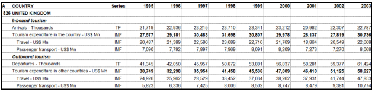
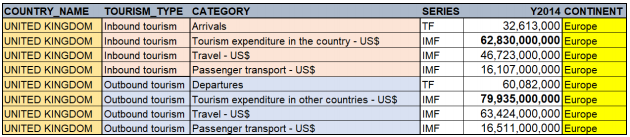

# Preparing World Tourism Data

## Introduction

The goal of this project is to prepare the data so that we can analyze inbound and outbound 2014 tourism for countries and continents. The cleaned_tourism table, the final_tourism table, and the nocountryfound table need to be delivered.

Table description:

**The tourism table.**
This table contains information about the arrivals of non-resident visitors, 
departures, and tourism expenditure in the country and in other countries.
The raw data was downloaded from the UN data website. 

**The country_info table.** 
This table contains country names and continent IDs. 
Let's dive a bit deeper into these tables. 
The tourism table contains information about international tourism. 
The two main categories of information in this table are 
inbound and outbound tourism for each country. 
Let's discuss these categories. 
Let's look at an example of outbound tourism. 
We have individuals from India traveling all around 
the world visiting countries like Italy to see the Coliseum, 
Russia to see Saint Basil's Cathedral, 
or to Australia to see the Sydney Opera House. 
All of these trips are considered outbound tourism from India and the table 
contains information about departures and tourism expenditure in US dollars. 
The Taj Mahal is a beautiful attraction in
India and considered one of the new seven wonders of the world. 
This is a very popular destination that travelers from all over the world come to visit. 
All of these trips are considered inbound tourism to India and 
the data contains information about arrivals and expenditure in US dollars. 
In it's original form, 
the tourism table consists of 23 columns and over 2,400 rows. 
Let's take a look at a partial image at the table. 
Here we can see information for the United Kingdom.
The A column contains a numeric ID when a country name appears in the country column. 
The country column contains a variety of information such as country names, 
tourism type, inbound or outbound, 
and tourism categories such as the number of arrivals or departures from 
a country or expenditure in the country or other countries in US dollars. 
The series column contains the data collection method used by the country. 
For example, IMF stands for International Monetary Fund. 
We won't focus much on this column in the case study. 
Columns _1995 through _2014,
contains scaled numeric data stored as text. 
The country column contains the information you need 
to properly convert this data to a numeric value. 
Values are US dollar amounts in millions for rows containing 
expenditure data and passenger count values for arrivals and departures are in thousands. 
For example, a scaled value of 21,719 for arrivals in thousands will be 
calculated by multiplying the number times 1,000 for a value of 21,719,000. 
The country_info table contains two columns and 250 rows. 
The continent column contains IDs for each continent. 
For example, one is North America, 
two is South America, and so on. 
Your document will list each value with the corresponding continent. 
The country column contains the name of each country.


_Raw data_



_Desired Outcome_



The first task is to restructure the tourism table and create the cleaned_tourism table.
The second task is to merge the newly restructured tourism table with the country-info table to create the final tourism table that only contains matching rows. 
The third task is to create a table named nocountryfound that contains a distinct list of countries that did not have matching rows from the country_info table.


## Data Requirements

** Create the cleaned_tourism table with the following column requirements:**
* **Country_Name** – contains the country name from the original Country column.
* **Tourism_Type** – contains the type of tourism from the original Country column. Valid values are Inbound tourism or Outbound tourism.
* **Category** – contains category names by extracting and modifying values from the original Country __column__. There should be six distinct values for __Category__ as shown in the table below:

| Values in the Country Column | New Values for the Category Column   |
|------|------|
|  Arrivals - Thousands  | Arrivals|
| Departures - Thousands | Departures|
| Passenger transport - US\$ Mn | Passenger transport - US\$ |
| Tourism expenditure in other countries - US\$ Mn| Tourism expenditure in other countries - US\$|
| Tourism expenditure in the country - US\$ Mn| Tourism expenditure in the country - US\$|
| Travel - US\$ Mn| Travel - US\$|


* **Series** – All values should be in uppercase and data that is not available (coded as "..") should
be changed to a missing character value.
* **Y2014** – contains numeric values that are calculated from the scaled character values in the
original **_2014** year column. The scaled values are multiplied by either thousands or millions
(abbreviated Mn), depending on the value listed for category in the **Country** column. The new
Y2014 values should be formatted with the COMMA format.
* Example: if the category is **Travel - US MN** and the value for **_2014** is 4.26, **Y2014** is
equal to 4.26 * 1000000, or 4,260,000.
* Include only **Country_Name**, **Tourism_Type**, **Category**, **Series**, and **Y2014** in the output
table.

** Merge the cleaned_tourism table with the country_info table and do the following:**
1. Create two new tables:
- final_tourism should contain only merged data.
- nocountryfound should contain a list of distinct countries from the cleaned_tourism
table that do not have a match in the country_info table.
2. Create a format for the Continent column that labels continent IDs with the corresponding
continent names. Permanently apply the format in the final_tourism table.
1 = North America
2 = South America
3 = Europe
4 = Africa
5 = Asia
6 = Oceania
7 = Antarctica


```sas
/*Create the cr library */

%let path=~/ECRB94/data;
%let outpath=~/ECRB94/output;
libname cr "&path";

/*Part 1*/
/*1. Remove years _1995 through _2013.*/
/*2. Create the Country_Name and Tourism_Type columns.*/

/*Part2*/
/*3. Convert values to uppercase for Series and convert '..' to missing values.*/
/*4. Determine the conversion type.*/
/*5. Change the data not available in _2014 to a single ".".*/

/*Part3*/
/*6. Create the Y2014 column by explicitly converting character values in _2014 and multiplying by the conversion type.*/
/*7. Create the new Category column and change the original values to the required values.*/
/*8. Permanently format Y2014.*/
/*9. Remove unnecessary variables.*/

data cleaned_tourism;
     length Country_Name \$300 Tourism_Type \$20;
     retain Country_Name "" Tourism_Type "";
     set cr.Tourism(drop=_1995-_2013);
     if A ne . then Country_Name=Country;
     if lowcase(Country) = "inbound tourism" then Tourism_Type = "Inbound tourism";
       else if lowcase(Country)  "outbound tourism" then Tourism_Type = "Outbound tourism";
     if Country_Name ne Country and Country ne Tourism_Type;
     series=upcase(series);
     if series=".." then Series="";
     ConversionType=scan(Country,-1," ");
     if _2014=".." then _2014=".";
     if ConversionType = "Mn" then do;
         if _2014 ne "." then Y2014 = input(_2014,16.) * 1000000;
           else Y2014=.;
         Category=cat(scan(country,1,'-','r'),' -US\$');
     end;
     else if ConversionType="Thousands" then do;
     if _2014 ne "." then Y2014 = input(_2014,16.) * 1000;
           else Y2014=.;
         Category=scan(country,1,'-','r');
     end;
     format Y2014 comma25.;
     drop A ConversionType Country _2014;
run;

proc freq data=cleaned_tourism;
     tables Country_Name Tourism_Type Series ConversionType;
run;

proc freq data=cleaned_tourism;
     tables country category;
run;

proc freq data=cleaned_tourism;
     tables Category Tourism_Type Series;
run;

proc means data=cLeaned_tourism min mean max n maxdec=0;
     var Y2014;
run;

/*Create the customer format*/
proc format;
     value contIDs
          1 = "North America"
          2 = "South America"
          3 = "Europe"
          4 = "Africa"
          5 = "Asia"
          6 = "Oceania"
          7 = "Antartica";
run;

/*Merge matching rows*/

proc sort data=country_info(rename=(Country=Country_Name))
         out=country_sorted;
     by country_name;
run;

/* Create the final_tourism and nocountryfound tables*/
data final_tourism NoCountryFound(keep=Country_Name);
     merge cleaned_tourism(in=t) Country_Sorted(in=c);
     by country_name;
     if t=1 and c=1 then output Final_Tourism;
     if(t=1 and c=0) and first.country_name=1  then output NoCountryFound;
     format continent contIDs.;
run;

proc freq data=final_tourism nlevels;
     tables category series Tourism_Type Continent /nocum nopercent;
run;

proc means data=final_tourism min mean max maxdec=0;
     var Y2014;
run;
```


